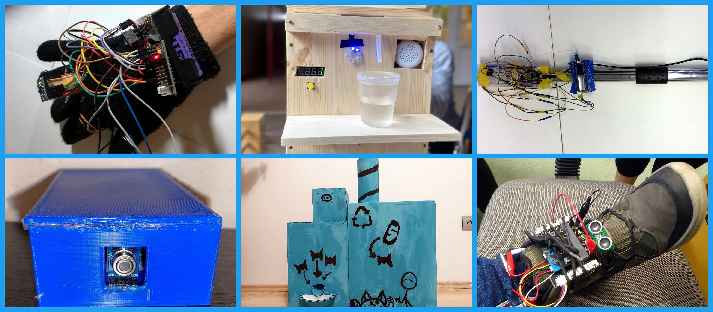

------------------------------
Title: PyCon SK preložený na jún 2021
Summary: Z bezpečnostných dôvodov sme sa rozhodli PyCon SK presunúť na jún 2021.
         Na jeseň ale zintenzívnime organizáciu Python meetupov a aj webinárov.
Author: Marek Mansell
Bio: <a href="//marekmansell.sk">Marek Mansell</a> je zanieteným edukátorom, organizátorom a experimentátorom. Pracuje na projekte Učíme s Hardvérom,
     spoluorganizuje PyCon SK, študuje na FIIT STU a pomáha s produkciou na Festivale Atmosféra.
Date: 15.7.2020
---------------------------

Ahojte Pythonisti,

pred niekoľkými mesiacmi sme stáli pred rozhodnutím, či PyCon SK 2020 v marci presunúť, alebo nie. Nakoniec sme sa rozhodli zodpovedne, ešte pred oficiálnymi pokynmi zo strany štátnych orgánov. Podobné rozhodnutie pred nami stálo aj teraz, **a z bezpečnostných dôvodov sme sa rozhodli PyCon SK presunúť na jún 2021**. Presný termín ešte dolaďujeme.

# Čo teraz s lístkami?
V zásade máš 3 možnosti:

1. Tvoj existujúci **lístok zostáva platný na PyCon SK v júni 2021**. Budeme veľmi radi, ak si ho ponecháš a zúčastníš sa konferencie. V tomto prípade nemusíš robiť nič, a zároveň nám táto možnosť pomôže s cash-flow, nakoľko niektoré poplatky sme začiatkom roka už museli uhradiť.
2. Ak už teraz vieš, že sa konferencie nemôžeš alebo nechceš zúčastniť, ale zároveň chceš pomôcť Python komunite na Slovensku, podpor ju dobrovoľným vzdaním sa lístku, čím **podporíš vzdelávacie aktivity** ako EduSummit, projekt [Učíme s Hardvérom](https://ucimeshardverom.sk/) či Python meetupy. Stačí, ak nám pošleš mail na info@pycon.sk
3. Samozrejme, ak by Ti prvé dve možnosti nevyhovovali, máš možnosť požiadať si o **vrátenie lístku**. Stačí, ak nám pošleš mail na info@pycon.sk

# Budú nejaké Python aktivity na jeseň 2020?
Áno, budú :-) Súčasná situácia praje skôr menším, lokálnym eventom. Práve preto **na jeseň zintenzívnime organizáciu Python meetupov a aj webinárov**. Zároveň chystáme aj nové kolo školení pre učiteľov informatiky po celom Slovensku v rámci projektu [Učíme s Hardvérom](https://www.ucimeshardverom.sk/). Ak Ťa tieto témy zaujali a chel(a) by si pomôcť s organizáciou (v ktoromkoľvek meste na Slovensku) alebo by si priamo chcel(a) prednášať na meetupe/webinári, ozvi sa nám na info@pycon.sk :-)

# Čo sa nám za uplunulé mesiace podarilo?
Počas pandémie sme vyhodnotili súťaž SPyCup a pustili sa do dvoch nových projektov - pomoci domovom seniorov a online webinárov.

Žiacku súťaž SPyCup sme úspešne vyhodnotili a žiakom odovzdali ceny, niektoré projekty sa dostali aj do televízie - viac informácií nájdete na [Facebooku](https://www.facebook.com/pg/ucimeshardverom/posts/)

V rámci projektu [Ochranné štíty zariadeniam pre seniorov](https://python.sk/stity_seniorom/ziadost/) sme celkovo **vyrobili a rozposlali 1000ks ochranných štítov do 93 domovov dôchodcov**.  Viac informácií nájdete na [Facebooku](https://www.facebook.com/ucimeshardverom/posts/680739332507904).

V spolupráci s FabLab Bratislava sme taktiež zorganizovali 5 webinárov na témy **Programovanie hry Flappy bird v PyGame Zero** a **Web Scraping s Requests a BeautifulSoup**.

