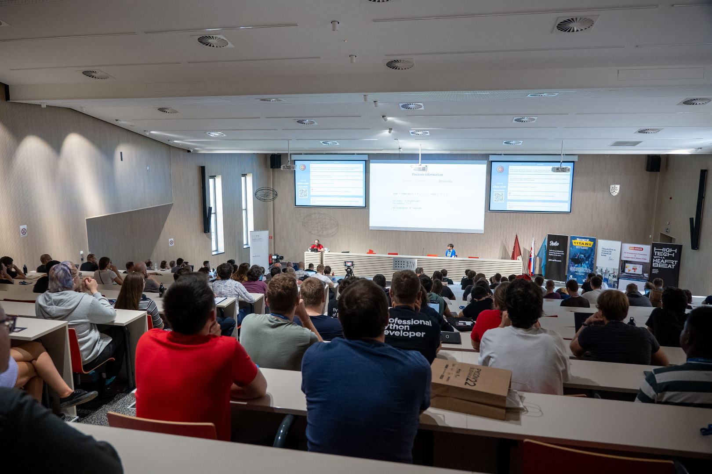
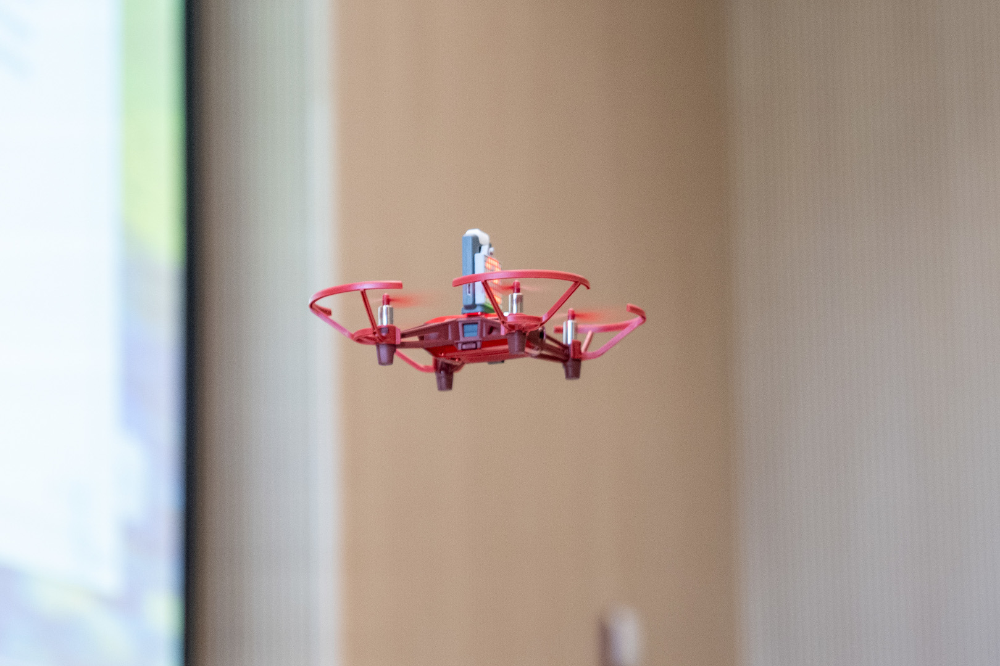

------------------------------
Title: PyCon SK 2022 Report
Summary: After three years, we were again able to meet in person and enjoy a weekend full of awesome talks, workshops,
         contests and networking.
Author: SPy - Slovak Python User Group
Bio: The mission of the SPy civic association (SPy is the abbreviation of "Slovak Python", or sometimes we say
     "Slovak Python User Group") is to support developers and users of the Python programming language. We support and
     we spread the programming language Python and other open source technologies and open source ideas in our society. 
Date: 26.9.2022
---------------------------

After three years, we were again able to meet in person and enjoy a weekend full of awesome talks, workshops, contests and networking.

### PyCon SK 2022 volunteers

[PyCon SK 2022](https://2022.pycon.sk/) was organised by a small group of volunteers from the Python community. Due to COVID-19, the last in-person PyCon SK conference was way back in 2019. During those three years many volunteers moved to different cities, started families or joined different volunteering organisations, meaning the core team was much smaller than in the past. Therefore, for the remaining core organisers, this year’s PyCon was more challenging than usual. However, the conference has fueled us and we’re ready to start organising the next PyCon SK :-)

](images/pycon2022-volunteers.jpg)

### Numbers

**Talks and workshops:**

* 38 talks (of which 7 were EduSummit talks).
* 9 workshops (of which 3 were EduSummit workshops).
* 2 Lightning Talk sessions and 1 EduTalks session.
* 1 Hardware Showcase session with students from the [ENTER contest](//enter.study/olympiada-v-programovani/).
* 1 Physical Computing Hackathon for teachers.
* 1 Conference Quiz with really awesome prizes (e.g. books, a keyboard, flasks, power banks, …).
* 1 Django Girls workshop.
* 1 PyLadies meetup.
* We had 180 participants interacting via Slido with 239 questions.

**Tickets:**

* There were 638 registered attendees, of which 447 attendees checked in (70%). Usually, the ratio of checked in attendees is much higher (90%), however, this year's attendance was affected by two years of postponing the conference.
* On Friday 88% of the conference attendees checked in, 9% on Saturday and 3% on Sunday.
* These numbers do not include Django Girls and PyLadies attendees.

**Ticket pricing:**

* Most of our paid tickets (95%) were sold at lower prices (25€-40€ for teachers/students, 40€-50€ for individual Pythonistas, 90€-100€ for companies). That means most of our tickets were sold at a much lower price than the actual expenses per paying attendee, which is possible thanks to our awesome financial sponsors.
* Only 4% of our tickets were sold at a "late bird" price (70€ for teachers, 100€ for individual Pythonistas, 200€ for companies).
* The remaining 1% of tickets were sold for 250€.
* However, paid tickets make up only about 70% of all PyCon SK tickets, the rest are issued free to speakers, volunteers, community and media partners, Django girls mentors as well as those who could not afford to attend PyCon SK because of financial reasons thanks to our Financial Aid program.

# Speakers

As PyCon SK is a community conference, none of our speakers get paid for their talk/workshop. We are really grateful for all the time and effort they have given into preparing for PyCon SK 2022. Even though the pandemic COVID-19 is still present, only two sessions were cancelled and one session was presented online.

When asked about the best speakers in the feedback form, the names Petr Viktorin, Tom Dyson and Miroslav Šedivý repeated the most often (in no particular order). In the EduSummit section it was Miroslav Biňas. An honourable mention also goes to Ondrej Salaj with his cable wrapping lighting talk.

This year, we had two exceptional Lighting Talk sessions both in the number of speakers as well as their overall quality.

# EduSummit

EduSummit is a special section of the conference focused on teaching programming at primary and secondary schools. During Friday and Sunday the attendees were introduced to innovative ways and methods of teaching programming, shared their knowledge of useful tools and last but not least participated in numerous workshops given by experienced educators. The keynote and first EduSummit 2022 talk was called “How to manage four years of high school ICT with Python only” which encouraged teachers to use Python for different purposes (web development, GUI apps, games, algorithms, hardware) and thus save precious time which would be spent by learning the basics of four programming languages, allowing students to have more time for going deeper into the individual topics.

# Sponsors

At PyCon SK 2022, we had 12 awesome sponsor booths. All of them featured something special: darts, VR, tea, special contests, “bratislavské rožky”, cotton candy… Thanks to them, the conference attendees had plenty of activities to choose from during coffee breaks. This year we also had the first conference breakfast provided by one of the sponsors.

The full list of our sponsors can be found here: [https://2022.pycon.sk/en/sponsors.html](https://2022.pycon.sk/en/sponsors.html) 

# Code of Conduct

PyCon SK attendees are required to follow the [Code of Conduct](https://2022.pycon.sk/en/coc.html) (CoC), which is based on the PSF’s CoC. The main principles of the CoC have been also mentioned in the conference openings on Friday and Saturday.

During the conference itself, the organisers have not noticed any CoC violation nor has any violation been reported to them. In the feedback forms, three issues were brought forward. Two involved a speaker using harsh language about a Python module or his colleagues. In these cases, the organisers reached out to the speakers. The third issue regarded mentioning a [pro-kremlin](https://www.theguardian.com/world/2022/aug/23/russia-yandex-sell-news-service-state-tightens-grip-online-media) company called Yandex by an attendee in his Lighting Talk. After a thorough discussion on the issue, we believe it was not the attendee’s intention to promote the company and it was only mentioned because it started the Clickhouse project many years ago, which has become [independent](https://clickhouse.com/blog/we-stand-with-ukraine) in the meantime.

# Photos and videos

* [PyCon SK 2022 and EduSummit photos](https://photos.app.goo.gl/2FwxWzbXXQLHXQsf6)
* [Django Girls only photos](https://photos.app.goo.gl/PPXcQ6hg5XmvbJjs6)
* [PyCon SK 2022 YouTube Playlist](https://www.youtube.com/watch?v=RXcCaxZf4jM&list=PLeK_HepiMJKIGVaNQU9EaQXQ0uM18gJvG)