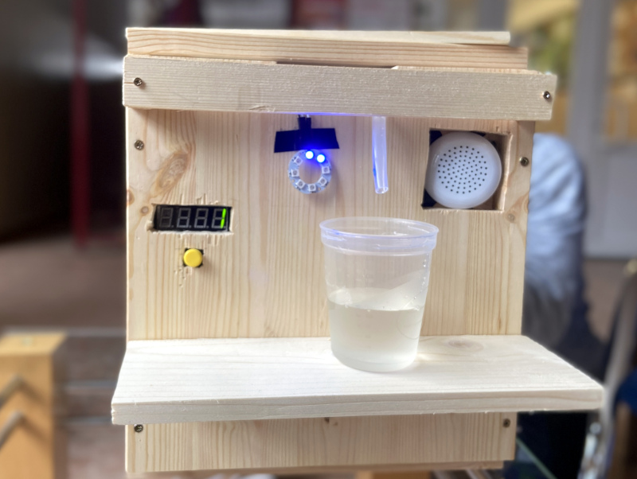
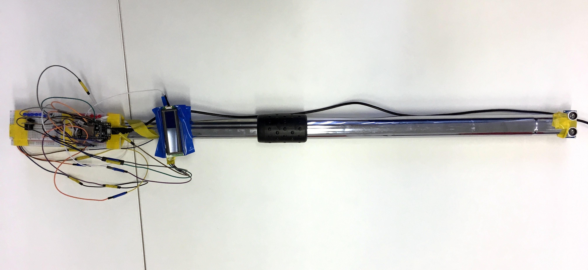

------------------------------
Title: Máme víťazov súťaže SPy Cup 2020
Summary: Žiacku súťaž SPyCup 2020 sme vyhodnotili a žiakom odovzdali ceny, niektoré projekty sa dostali aj do televízie.
Author: Nika Klimová, Bibiána Kleinová, Marek Mansell
Date: 13.8.2020
---------------------------

Aj tento rok sa sformovali tímy zo základných a stredných škôl, aby zabojovali v súťaži SPy Cup so svojím hardvérovým projektom. V poradí už druhý ročník súťaže mal dve kategórie:

1. Projekt riešiaci sociálny problém (najmä znevýhodnených ľudí) 
2. Projekt riešiaci ekologický problém

Žiaci pri tvorbe projektov mohli využívať platformy  BBC micro:bit, NodeMCU či Raspberry Pi. Odporúčané programovacie jazyky boli Python, MicroPython, či blokové programovacie prostredie. 

Súťažné tímy odoslali projektový zámer - textovú a vizuálnu dokumentáciu spolu so zdrojovým kódom. Porota hodnotila podľa nasledovných kritérií:

- Analýza problému
- Riešenie
- Konštrukcia prototypu
- Program
- Prezentácia

Finále súťaže s oznámením súťažiacich malo prebehnúť na medzinárodnej konferencii PyCon 2020 v sekcii EduSummit, ale situáciu nám skomplikoval vírus COVID-19, následkom čoho sme konferenciu presunuli na ďalší rok. Oznámenie víťazov prebehlo v netradičnom štýle – vyhlásili sme víťazov na Facebooku. Posledný školský týždeň sme tímom odoslali ceny spolu s diplomami do škôl, spolu s pozvánkou na prezentáciu svojho projektu na najbližšej konferencii PyCon. Ďakujeme [Metrohm Research Slovakia](https://www.metrohm.com/sk-sk/spolocnost/sk-metrohm-research/) a [RLX Components s.r.o.](http://rlx.sk/), našim partnerom súťaže za vecné ceny.

---

## Poradie víťazných tímov

**Kategória základné školy:**

1. miesto: Banány v čokoláde, CVČ Šaľa
2. miesto: Matúš, ZŠ s MŠ Milana Hodžu v Bratislave
3. miesto: Lev ochrany, ZŠ kniežaťa Pribinu v Nitre

**Kategórie stredné školy:**

1. miesto: RoboD, Gymnázium Golianova v Nitre
2. miesto: Horalki, Gymnázium Vojtecha Mihálika v Seredi
3. miesto: Divergentní, 1. súkromné gymnázium v Bratislave

---
 
*⬇️ Nahliadnite aj do hardvérových projektov jednotlivých prác popísaných samotnými tímami ⬇️*

#### ZŠ 1. miesto: Projekt Prizes for Bottles Thing

Tím Banány v čokoláde z CVČ Šaľa

Po vhodení fľaše Vás Prizes for Bottles Thing odmení cukríkmi. "Náš projekt motivuje ľudí triediť 🗑️ odpad. Mohol by byť použitý napríklad 🚂 vo vlakoch alebo 🏫 na školách. Za vytriedený odpad odmeníme ľudí," tvrdia členovia tímu.

 

    <iframe class="embed-responsive-item" width="560" height="315" src="https://www.youtube.com/embed/2bJDdNLC2gU" frameborder="0" allow="accelerometer; autoplay; encrypted-media; gyroscope; picture-in-picture" allowfullscreen></iframe>

#### ZŠ 2. miesto: Projekt Teplomer pre nevidiacich

Matúš, ZŠ s MŠ Milana Hodžu v Bratislave

Na teplomer bol použitý BBC micro:bit a obal vytvorený pomocou 3D tlačiarne. 

 

    <iframe class="embed-responsive-item" width="560" height="315" src="https://www.youtube.com/embed/uwdTbxV6Ftg" frameborder="0" allow="accelerometer; autoplay; encrypted-media; gyroscope; picture-in-picture" allowfullscreen></iframe>

#### ZŠ 3. Miesto: Projekt Schodomer

Lev ochrany, ZŠ kniežaťa Pribinu v Nitre

Cieľom projektu je, aby 🕶️ nevidiaci mohli kráčať po schodoch bez strachu, pretože Schodomer im 📯 signalizuje schody. "Páči sa nám, že pomáhame nevidiacim. Konštrukcia hardvéru má výhody: ľahké zaväzovanie na 🥾 šnurovaciu topánku, ľahké zapínanie, prázdne ruky a nepoškodzuje zdravie," hovorí Lev ochrany.

 

    <iframe class="embed-responsive-item" width="560" height="315" src="https://www.youtube.com/embed/b1hPbHcPv18" frameborder="0" allow="accelerometer; autoplay; encrypted-media; gyroscope; picture-in-picture" allowfullscreen></iframe>

#### SŠ 1. miesto: Projekt Water Buddy

Tím RoboD, Gymnázium Golianova v Nitre

Projekt rieši dodržiavanie pitného režimu. "My si myslíme, že miesto rôznych komplexných problémov by sme sa mali zamerať najprv na tie jednoduchšie. Je vedecky dokázané, že nedostatok vody spôsobuje 🏥 zdravotné ťažkosti a toto je presne to, čo sa snažíme riešiť. Nechceli sme spraviť nič komplikované. Chceli sme dosiahnuť náš cieľ čo najjednoduchšie. Projekt vyniká aj svojim zameraním na domácnosti alebo kancelárie - miesta kde človek 👨‍💻 pracuje, ale nepremiestňuje sa často," tvrdia Tallie and Shortie, ktorí projekt vytvorili.

 

    <iframe class="embed-responsive-item" width="560" height="315" src="https://www.youtube.com/embed/St-XO3Y_pKs" frameborder="0" allow="accelerometer; autoplay; encrypted-media; gyroscope; picture-in-picture" allowfullscreen></iframe>

#### SŠ 2. miesto: Projekt RuMy

Horalki, Gymnázium Vojtecha Mihálika v Seredi

Ich prototyp dokáže plnohodnotne ovládať počítač bez použitia 🖱️ myši, stačí si len obliecť 🧤 rukavicu! "V podobných projektoch sa musí človek dotknúť palca, aby stlačil tlačidlo, v našom nemusí," hovoria Horalki.

 

    <iframe class="embed-responsive-item" width="560" height="315" src="https://www.youtube.com/embed/2uKsmdfvSug" frameborder="0" allow="accelerometer; autoplay; encrypted-media; gyroscope; picture-in-picture" allowfullscreen></iframe>

#### SŠ 3. miesto: Projekt Palička pre nevidiacich

Divergentní, 1. súkromné gymnázium v Bratislave

So slovami: "Neexistuje lepší pocit ako pomôcť druhým ľuďom, obzvlášť, keď to potrebujú," ozrejmuje svoj projekt 👩 autorka. "Toto inovatívne riešenie predstavuje jeden z prvých prototypov paličiek pre nevidiacich budúcnosti. Predpokladáme, že postupom času budú všetky klasické paličky nahradené elektronickými. Považujeme za veľký úspech, že sa nám takúto paličku podarilo zhotoviť. Palička navyše obsahuje okrem 🔊 zvukovej signalizácie aj 🚥 svetelnú. LCD displej upozorňuje okoloidúcich, že používateľ je nevidiaci. Jedinečný nápad a originálne prevedenie robia tento projekt výnimočným."

