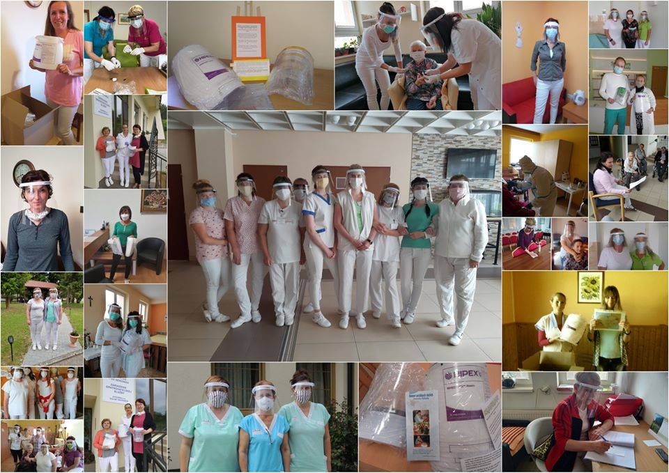
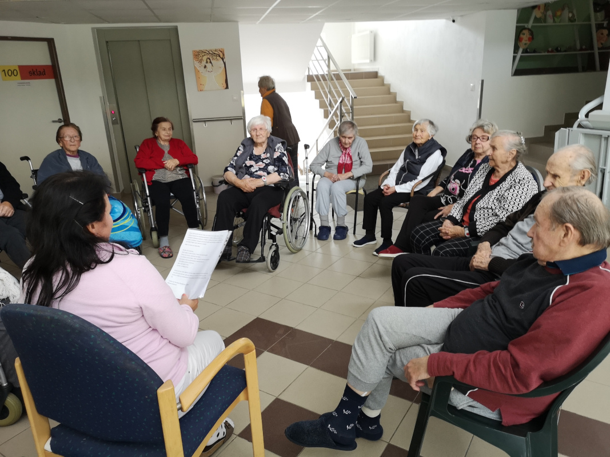

------------------------------
Title: Rozposlali sme 1000 ochranných štítov do 93 domovov seniorov
Summary: V rámci projektu Ochranné štíty zariadeniam pre seniorov sme celkovo vyrobili a rozposlali 1000ks
         ochranných štítov do 93 domovov dôchodcov.
Author: Nika Klimová, Bibiána Kleinová, Marek Mansell
Date: 10.8.2020
Hidden: True
---------------------------

Keď na jar vypukla korona kríza, vedeli sme, že chceme pomáhať tým, ktorí musia čeliť vírusu v pomyselnej prvej línií. Správy zo sveta aj z domova nás nenechávali chladnými.  Z informácií, ktoré sme mali z médií, sme vedeli, že zdravotníkom chýbajú základné ochranné pomôcky. Situácia sa zhoršovala a prvých nakazených hlásil Domov sociálnych služieb (DSS) v Pezinku. Vnímali sme, že chceme pomôcť najmä týmto skupinách ktorých vírus najviac ohrozuje. 

Na 3D tlačiarni sme skúsili vytvoriť vlastný model ochranného štítu, prešiel testovaním a vylepšením, aby bol napríklad vhodný aj pre ľudí s okuliarmi. Hľadali sme možnosti, ako poskytnúť ochranné štíty tam, kde to bude potrebné. Získali sme granty z Nadácie Orange, Nadácie Henkel a Kto pomôže Slovensku, z týchto peňazí sme mohli pokryť materiál na 1 000 kusov štítov. Vytvorili sme prihlasovací formulár a rozposlali ho do všetkých DSS na Slovensku. V priebehu troch dní sa prihlásilo 93 DSS s požiadavkou na 1845 štítov.

Snažili sme sa štíty prerozdeliť čo najviac spravodlivo– tak, aby boli kusy ochranných štítov rovnomerne v každom kraji, prihliadali sme aj na počet klientov či počet ľudí v tzv. A tíme.  A tím mali vypracované všetky DSS, patrili doň opatrovatelia, ktorí by v prípade nákazy ostali v zariadeniach spolu so seniormi v bezprostrednom kontakte. Snažili sme sa čo najskôr vyhodnotiť dotazníky a posielať štíty tam, kde boli potrebné.  

Pre nás to znamenalo mať 3 kusy 3D tlačiarní zapnutých takmer nonstop, tlačili sme denne 20 - 22 hodín, kontrolovali kvalitu tlače, prípadne obrusovali hrany, lepili mäkké časti na polstrovanie pre pohodlnosť nosenia, vyrezávali a obrusovali priehľadné časti štítov, zakladali dierkované gumičky, balili a odosielali. Tento proces u nás prebehol 1 000 - krát :)

Okrem toho sme sa seniorom rozhodli pomôcť aj nemateriálne. Počas korony boli v týchto zariadeniach zakázané návštevy, a my sme chceli potešiť aj klientov zariadení. Rozhodli sme sa zorganizovať podprojekt, ktorý  dostal romantický názov - Májový list seniorom.  Mottom “Pomáhať je jednoduché, naozaj!”, sme vyzvali aj tých najmenších na pomoc. Poprosili sme, aby nám poslali elektronické listy a obrázky, tie sme vytlačili a odoslali v krabici spolu s ochrannými štítmi. 

 

    <iframe class="embed-responsive-item" width="560" height="315" src="https://www.youtube.com/embed/p29ZAiv_2qE" frameborder="0" allow="accelerometer; autoplay; encrypted-media; gyroscope; picture-in-picture" allowfullscreen></iframe>

Na naše potešenie sa zapojili nielen deti s rodičmi, ale aj 14 škôl.  Listov od detí sme dostali 129 písaných či kreslených. Všetky listy si našli svojich majiteľov. 

Prekvapilo nás, akú pozitívnu odozvu listy mali. Chodili nám fotky z DSS a najväčším prekvapením bol list od dôchodcu, ktorý deťom odpísal. 

Deťom sme za pomoc odoslali diplomy spolu s informáciami, kam listy putovali. Školy získali čestné uznanie. 

Sme radi, že sme mohli našimi projektami prispieť v boji s koronavírusom. Ďakujeme našim partnerom, ktorí nám finančne prispeli: Nadácia Orange, Nadácia Henkel a Kto Pomôže Slovensku. Taktiež ďakujeme firme Accenture, ktorá nám pomáhala tlačiť 3D štíty a prispela nám 100 kusmi farebných držiakov na ochranné štíty. Ďakujeme!

Celý zoznam podporených zariadení a ďalšie informácie nájdete na [stránke projektu](https://python.sk/stity_seniorom/ziadost/)